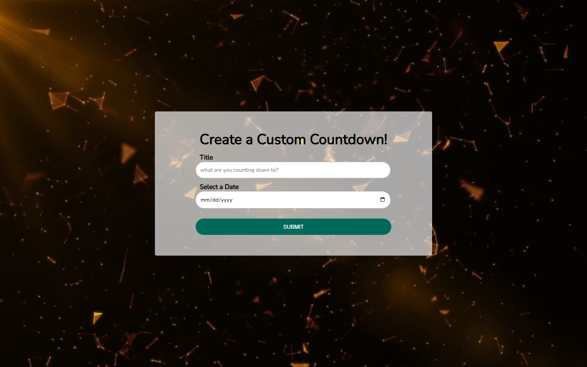

# Custom Countdown | ZTM JS Web Projects Course

**Project 9/20**

⏳ Custom Countdown is a dynamic web app that lets users create personalized countdowns to any date with a custom title. Featuring a video background, real-time countdown updates, and local storage support, this project provides both functionality and flair.

---

## 📚 Table of Contents

- [🔎 Overview](#-overview)
  - [📸 Screenshot](#-screenshot)
  - [🔗 Links](#-links)
  - [📌 Features](#-features)
- [🧠 My process](#-my-process)
  - [🛠️ Built with](#️-built-with)
  - [🎓 What I learned](#-what-i-learned)
  - [🔙 Previous Project](#-previous-project)
  - [🔜 Next Project](#-next-project)
  - [🗃️ Useful resources](#️-useful-resources)
- [👤 Author](#-author)
  - [🌐 Connect with Me](#-connect-with-me)
  - [💻 Coding Profiles](#-coding-profiles)

---

## 🔎 Overview

### 📸 Screenshot

### 🔗 Links

 - [🔴 Live Demo](https://dalascript.github.io/custom-countdown/)
 - [🗂️ GitHub Repository](https://github.com/DalaScript/custom-countdown)

### 📌 Features

 - ✅ Create a custom countdown with a title and selected date
 - ✅ Real-time countdown updates (days, hours, minutes, seconds)
 - ✅ Animated background video with overlay
 - ✅ Auto-reset and countdown completion detection
 - ✅ LocalStorage saves countdowns between page reloads
 - ✅ Responsive and mobile-friendly design
 - ✅ Colorful animated text when countdown is complete
 - ✅ Input validation to prevent empty submissions

---

## 🧠 My Process

### 🛠️ Built with

 - HTML5
 - CSS3
 - Vanilla JavaScript

### 🎓 What I Learned

 - How to use JavaScript `setInterval()` for real-time countdowns
 - Reading, writing, and parsing JSON in `localStorage`
 - Managing DOM updates dynamically using form inputs
 - Creating engaging UIs with `<video>` and layered overlays
 - Building animated styles using CSS keyframes

  > 🚀 For me, this project was more about **practice** and gaining additional **experience**,  
  > rather than learning something entirely new.  
  >  
  > 👨‍💻 Since I’m not a beginner and already familiar with these technologies,  
  > I approached it with confidence — and still, I truly **enjoyed working on it**.  
  >  
  > 🎯 Overall, I consider this a very **valuable and enjoyable experience**.

### 🔙 Previous Project

 - Music Player | *[Project 8/20]* → [View Repository](https://github.com/DalaScript/music-player)

### 🔜 Next Project

 - Book Keeper | *[Project 10/20]* → [View Repository](https://github.com/DalaScript/book-keeper)

### 🗃️ Useful resources

 - [Pixabay Stock Videos](https://pixabay.com/videos/) – Free video backgrounds for web use
 - [Video Compression Tool](https://www.youcompress.com/) – Compress large videos for faster load
 - [Mozilla - Form Accessibility](https://developer.mozilla.org/en-US/docs/Web/Accessibility/ARIA) – Make forms more accessible
 - [Google Fonts](https://fonts.google.com/) – Web-safe fonts for custom UI
 - [Mozilla - Date Input](https://developer.mozilla.org/en-US/docs/Web/HTML/Reference/Elements/input/date) – Using native date pickers
 - [W3Schools - Date Object](https://www.w3schools.com/jsref/jsref_obj_date.asp) – JavaScript date manipulation
 - [Mozilla - Date toISOString](https://developer.mozilla.org/en-US/docs/Web/JavaScript/Reference/Global_Objects/Date/toISOString) – Convert date to ISO format
 - [W3Schools - String Split](https://www.w3schools.com/jsref/jsref_split.asp) – Split string values
 - [Mozilla - Submit Event](https://developer.mozilla.org/en-US/docs/Web/API/HTMLFormElement/submit_event) – Handle form submissions
 - [W3Schools - Prevent Default](https://www.w3schools.com/jsref/event_preventdefault.asp) – Prevent default form actions
 - [W3Schools - JS Timing Events](https://www.w3schools.com/js/js_timing.asp) – Use `setInterval()` and `setTimeout()`
 - [Mozilla - JSON Stringify](https://developer.mozilla.org/en-US/docs/Web/JavaScript/Reference/Global_Objects/JSON/stringify) – Convert JS to JSON
 - [Mozilla - JSON Parse](https://developer.mozilla.org/en-US/docs/Web/JavaScript/Reference/Global_Objects/JSON/parse) – Convert JSON to JS

---

## 👤 Author

### 🌐 Connect with Me

 - [Instagram](https://www.instagram.com/DalaScript)
 - [YouTube](https://www.youtube.com/@DalaScript)

### 💻 Coding Profiles

 - [freeCodeCamp](https://www.freecodecamp.org/DalaScript)
 - [FrontendMentor](https://www.frontendmentor.io/profile/DalaScript)
 - [GitHub](https://github.com/DalaScript)

*🙌 Thanks for checking out my project! More coming soon. Stay tuned 🚀*
